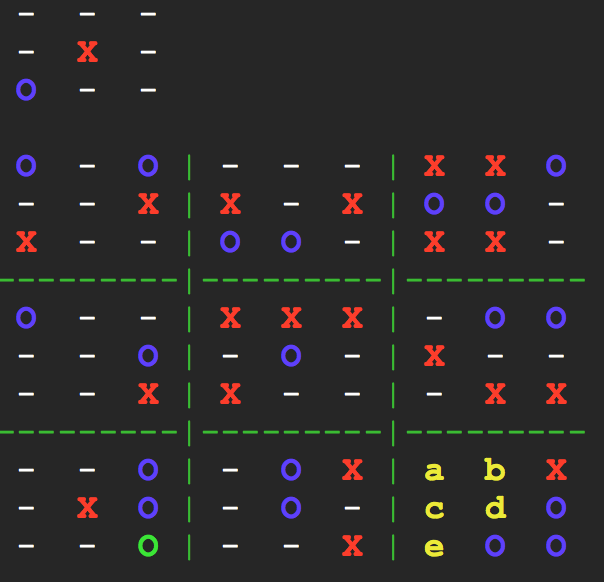

# negamax
## neil khemani

i implemented [negamax](https://en.wikipedia.org/wiki/negamax) in C, as well as 2 games: [ultimate tic-tac-toe](https://en.wikipedia.org/wiki/ultimate_tic-tac-toe) & [sim](https://en.wikipedia.org/wiki/sim_(pencil_game)). so, you can play against the negamax algorithm in either game.

this code contains the back-end for the AI in my iOS game: **[zig zag zoe](https://itunes.apple.com/app/id1222417649)** (no longer on app store).

this is how an AI-vs.-AI zig-zag-zoe game looks on the terminal:

see the "[artwork](artwork)" folder for a video of the AI versus itself.

